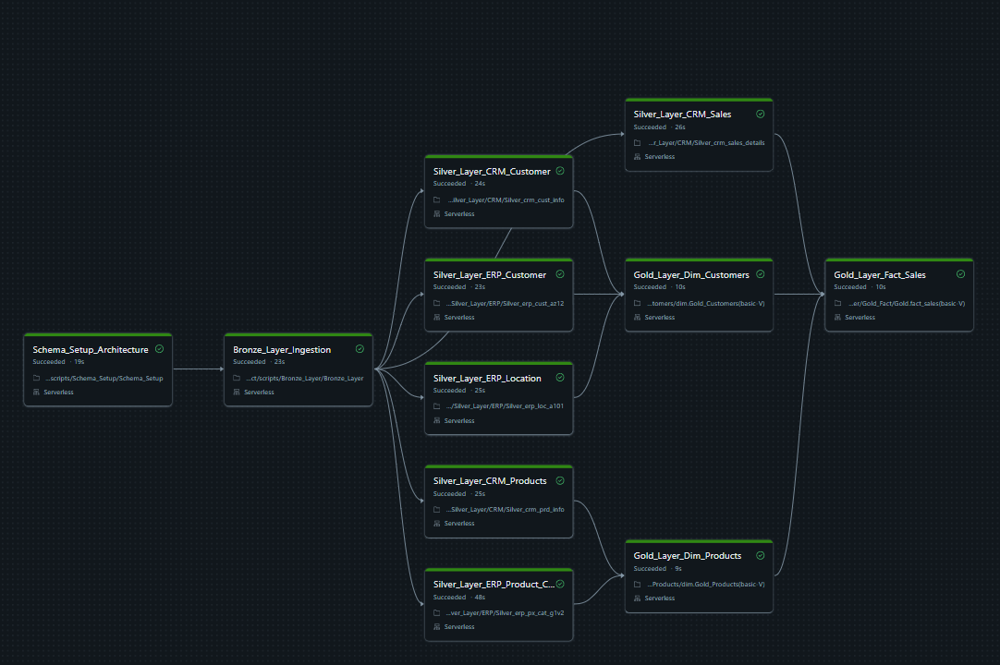

# Databricks_Lakehouse_Pipeline_Project (Medallion Architecture)


This project demonstrates an end-to-end Medallion pipeline developed on Databricks Lakehouse Platform.
The pipeline extracts raw operational records from separate CRM and ERP source systems, cleans and normalizes them through progressive Delta layers, and structures the final data into an analytics-ready Star Schema for downstream business intelligence..

## 🏗️ Pipeline Design & Orchestration

Pipeline execution and task dependencies are managed using **Databricks Workflows** deployed on serverless compute.



## ⚙️ Pipeline Workflow & Execution

The Databricks workspace executes the data pipeline through three distinct phases:

*   **Phase 1: Central Raw Ingestion (Bronze)** 
    The pipeline starts with a single notebook that reads and loads all six raw CSV files into Bronze Delta tables. Handling all raw sources inside one central notebook keeps the initial setup clean and easy to manage.

*   **Phase 2: Parallel Cleaning Tasks (Silver)** 
    Once the raw data is ready, the pipeline splits into six parallel tasks to clean each table simultaneously. Running these cleaning notebooks at the exact same time prevents a long waiting line and drastically cuts down the total runtime.

*   **Phase 3: Star Schema Assembly (Gold)** 
    The separate clean data streams come together to build the final reporting tables. The pipeline updates both the customer and product dimension tables together, then triggers the central sales fact notebook last so that all lookup data is fully ready.

---

## 🛠️ Technology Stack
* **Core Platform:** Databricks Lakehouse
* **Storage Layer:** Delta Lake (ACID Transactions, Schema Enforcement)
* **Compute Infrastructure:** Serverless Apache Spark Pools
* **Development Languages:** PySpark, Spark SQL, Python
* **Orchestration & Scheduling:** Databricks Jobs (DAG Architecture)

---

## 💾 Data Layer Specifications

### 1. Bronze Layer (Raw Ingest)
Acts as the historical landing zone for the system. Data is pulled directly from cloud storage volumes mapped to two distinct operational source domains:
* **CRM Source:** Extracts raw files containing customer profiles, product specifications, and transactional sales details.
* **ERP Source:** Extracts backend operational files managing customer master data, localized geographic regions, and global product categories.


### 2. Silver Layer (Cleaned & Standardized)
The Silver layer processes the raw Bronze tables into a standardized, query-ready format. Each data stream passes through a consistent data-cleaning pipeline to ensure downstream reliability:
* **Data Type Enforcement:** Converts inconsistent raw source columns into strict, structured data types (such as formatting string timestamps into proper date types).
* **Data Quality Normalization:** Resolves data layout issues, replaces missing or invalid values with standard defaults, and fixes inconsistent text casing.
* **Record Deduplication:** Identifies and removes duplicate rows using unique business keys to maintain strict data integrity across tables.


### 3. Gold Layer (Star Schema Analytics)
The Gold layer transforms the clean Silver data into a Star Schema model designed for business reporting. It structures the data into two dimension tables and one central fact table:
* **`dim_customers`**: Combines customer profiles from both the CRM and ERP systems into a single master customer table.
* **`dim_products`**: Matches active operational products with their correct category descriptions while filtering out old, inactive items.
* **`fact_sales`**: Stores core business metrics like sales amounts, quantities, and prices, connecting them directly to the customer and product tables using lookup keys.

---

## 🚀 System Design & Optimizations

### Optimizing Star Schema Queries
Joining heavy transactional sales data with dimension tables can slow down Spark because it moves data across the network (known as a shuffle). Since the `dim_products` and `dim_customers` tables are relatively small, we use **Broadcast Hints**. This copies the small lookup tables directly to every active worker node, turning an expensive network shuffle into a fast local join.

### Safe Pipeline Restarts (Rerun-Safe)
To prevent data corruption and duplication, every notebook writes data using an overwrite mode (`.mode("overwrite")`). If the pipeline fails halfway through due to a cloud glitch or network timeout, you can safely restart the whole job from the beginning without creating duplicate rows or breaking the table schemas.

### Handling Temporary Failures
Each task inside the Databricks Workflow has isolated retry settings. If a single notebook fails because of a temporary storage or network issue, Databricks automatically retries only that specific step. The other parallel tasks keep running smoothly without stopping or crashing the entire pipeline.

---

## 📂 Repository Structure

```text
├── code/
│   ├── Bronze_Layer/
│   │   └── Bronze_Layer.py            # Looping configuration ingestion notebook
│   ├── Silver_Layer/
│   │   ├── CRM/
│   │   │   ├── Silver_crm_cust_info.py
│   │   │   ├── Silver_crm_prd_info.py
│   │   │   └── Silver_crm_sales_details.py
│   │   └── ERP/
│   │       ├── Silver_erp_cust_az12.py
│   │       ├── Silver_erp_loc_a101.py
│   │       └── Silver_erp_px_cat_g1v2.py
│   └── Gold_Layer/
│       ├── dim_customers.py           # Customer Dimension Notebook
│       ├── dim_products.py            # Product Dimension Notebook
│       └── fact_sales.py              # Sales Fact Notebook (Optimized)
├── doc/
│   └── pipeline_dag.png               # Databricks Workflows DAG Screenshot
└── README.md
